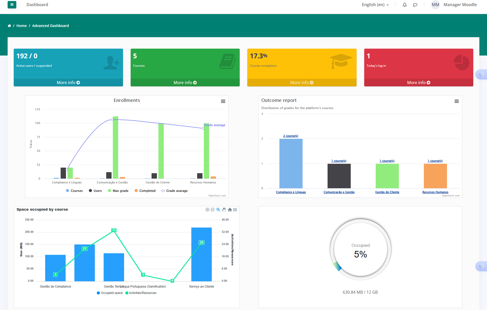
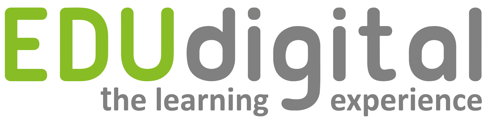

# EDUdashboard - Moodle Plugin

## Introduction

EDUdashboard is a powerful plugin for Moodle that provides detailed graphical reports and analytics for platform administrators and decision-makers. With this plugin, users can monitor platform activity, track user engagement, and visualize key performance indicators (KPIs) with ease.

## Features

- **User Insights:** Extract data on active users, enrollments, and authentication trends.
- **Course Analytics:** View the number of available courses and their completion rates.
- **Performance Monitoring:** Track daily logins, activities completed, and knowledge areas covered.
- **Graphical Dashboards:** Access visually appealing charts and tables to analyze learning trends.
- **Custom Reports:** Generate customized reports on user activity and course engagement.
- **Role-Based Access:** Different user roles (administrators, managers, etc.) can access relevant reports.

## Screenshots

### Dashboard Overview

## Installation

1. Download the latest release from [Moodle Plugin Directory](https://moodle.org/plugins/).
2. Extract the plugin into the `local/edudashboard` directory of your Moodle installation.
3. Navigate to **Site Administration > Notifications** to complete the installation.
4. Configure the plugin under **Site Administration > Plugins > EDUdashboard**.

## Requirements

- Moodle **3.0+** (compatible with Moodle 4.x)
- PHP **7.4+**
- Database: MySQL / PostgreSQL

## Usage

1. Access the plugin via **Site Administration > Reports > EDUdashboard**.
2. Select the type of report you wish to generate.
3. Filter data based on time range, user roles, and course categories.
4. Export reports in CSV or PDF format for further analysis.
5.Access the plugin directly via the URL: {your_moodle_url}/local/edudashboard/. For example, if your Moodle site is hosted at http://example.com/moodle, visit http://example.com/moodle/local/edudashboard/ to view the EDUdashboard interface.

## Security & Performance

- The plugin follows Moodle's coding standards and security best practices.
- It does not store unnecessary data beyond Moodle's native logs.
- Unused features have been disabled to prevent unauthorized reactivation.

## Support & Contributions

For issues, feature requests, or contributions, please visit our GitHub repository:
[GitHub Repository](https://github.com/edudigital/moodle-local_edudashboard)

## Acknowledgements

This plugin was developed by taking inspiration from various existing Moodle plugins, including the reporting solutions provided by the Edwiser team. We are grateful for the open-source community and the contributions of other developers, which have helped shape the features and functionality of EDUdashboard.

## License

This plugin is licensed under the **GPL v3** license.

© 2024 EduDigital. All rights reserved.